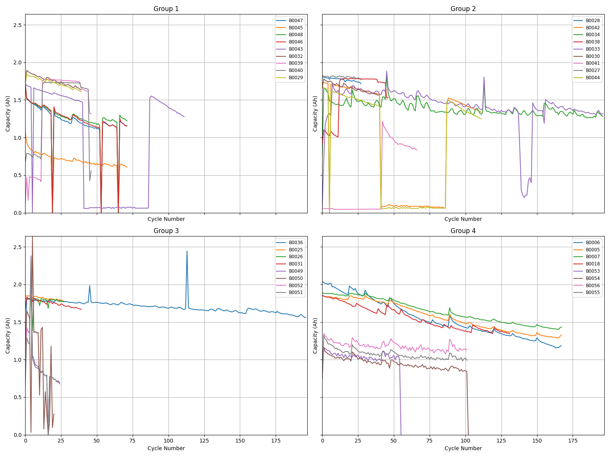
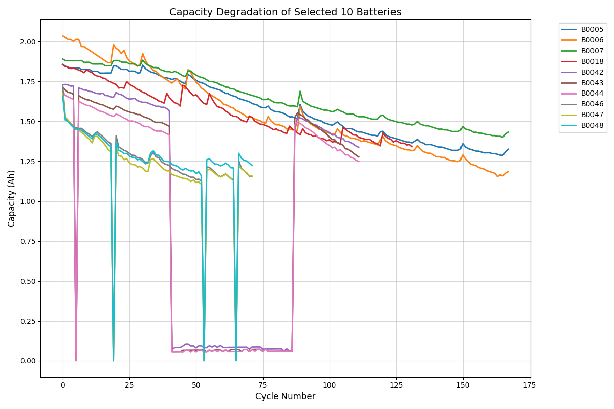
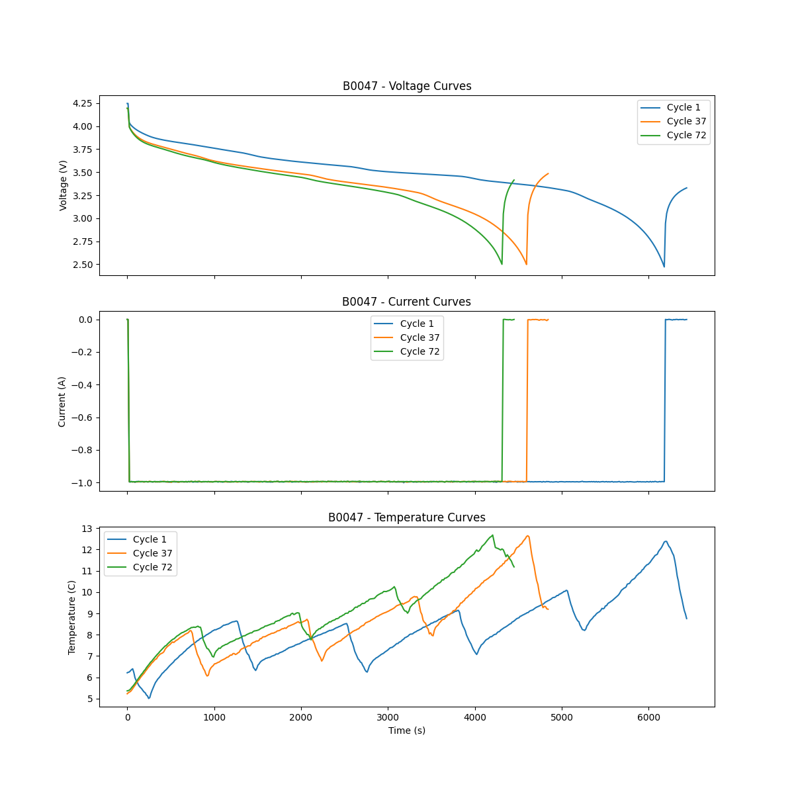
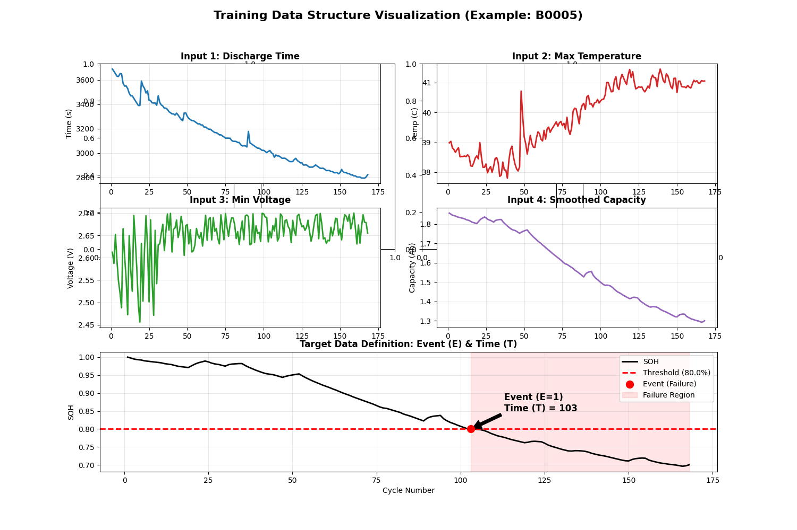

# DeepSurv 배터리 수명(EOL) 예측 프로젝트

이 프로젝트는 NASA 배터리 데이터셋을 활용하여 리튬 이온 배터리의 수명 종료(End-of-Life, EOL) 위험을 예측하는 DeepSurv 생존 분석 모델을 PyTorch로 구현한 것입니다. Cox Proportional Hazards 모델을 딥러닝으로 확장하여 배터리의 잔여 수명(RUL)을 정확하게 예측합니다.

---

## 📁 프로젝트 구조 (Project Structure)

```
Battery_ESS_Project/
├── src/                                    # 소스 코드 디렉토리
│   ├── DeepSurv_Pytorch_v2.py              # DeepSurv 모델 구현 및 K-Fold 교차 검증
│   ├── eda_analysis.py                     # 전체 배터리 데이터 탐색 및 이상치 분석
│   ├── eda_covariates.py                   # 전압/전류/온도 공변량(Covariates) 분석
│   ├── eda_selected_batteries.py           # 학습용 고품질 배터리 10개 선별 및 시각화
│   ├── visualize_training_data.py          # 학습 데이터 구조 및 타겟 변수 정의 시각화
│   └── visualize_model_performance.py      # 모델 성능 평가 및 Risk Score 분석
├── plots/                                  # 시각화 결과물 저장소
│   ├── capacity_trends_grouped.png         # 전체 배터리 용량 열화 추세 (4그룹)
│   ├── capacity_trends_selected.png        # 선별된 10개 배터리 용량 열화
│   ├── covariates_B0005.png                # B0005 배터리 공변량 시계열
│   ├── covariates_B0047.png                # B0047 배터리 공변량 시계열
│   ├── training_data_visualization.png     # 학습 데이터 피처 및 타겟 정의
│   └── model_performance_metrics.png       # 5-Fold 성능 및 Risk Score 분석
├── results/                                # 분석 결과 데이터
│   └── battery_stats.csv                   # 배터리별 통계 (사이클 수, 초기/최종 용량 등)
├── cleaned_dataset/                        # NASA 배터리 데이터셋
│   ├── metadata.csv                        # 배터리 메타데이터 (배터리 ID, 사이클, 용량 등)
│   └── data/                               # 개별 사이클별 시계열 데이터 (전압, 전류, 온도)
└── README.md                               # 프로젝트 문서 (본 파일)
```

---

## 🔬 소스 코드 상세 설명 (Source Code Analysis)

### 1. `DeepSurv_Pytorch_v2.py` - DeepSurv 모델 구현 및 학습

#### 🎯 핵심 기능
- **BatteryDataset 클래스**: NASA 배터리 데이터를 PyTorch Dataset으로 변환하며, 다음 전처리를 수행합니다:
  - **이상치 필터링**: 초기 용량 1.5Ah 미만, 사이클 50회 미만 배터리 제외
  - **용량 스무딩**: 5-window 이동평균을 통한 노이즈 제거
  - **SOH 계산**: State of Health = (현재 용량 / 초기 용량)
  - **이벤트 정의**: SOH < 0.8 도달 시 Event=1 (Uncensored), 미도달 시 Event=0 (Censored)
  - **피처 추출**: 각 사이클마다 방전시간, 최고온도, 최저전압, 스무딩 용량 4개 피처 생성

- **DeepSurv 모델 아키텍처**:
  ```
  Input (4차원) → FC(64) → ReLU → BatchNorm → Dropout(0.1) 
                → FC(32) → ReLU → BatchNorm → Dropout(0.1) 
                → FC(1) → Log Hazard Ratio
  ```
  - **설계 의도**: 
    - BatchNorm으로 학습 안정화 및 내부 공변량 변화(Internal Covariate Shift) 완화
    - Dropout으로 과적합 방지 및 일반화 성능 향상
    - 얕은 네트워크(2-layer)로 소규모 데이터에서 파라미터 효율성 확보

- **Cox Proportional Hazards Loss**:
  ```python
  def cox_ph_loss(log_h, t, e):
      # Negative Log Partial Likelihood
      # 시간 기준 내림차순 정렬 → Risk Set 계산 → 우도 최대화
  ```
  - **의의**: 생존 분석의 고전 기법인 Cox 모델을 딥러닝으로 확장하여, 중도절단(Censored) 데이터를 자연스럽게 처리할 수 있는 손실 함수입니다.

- **C-Index (Concordance Index)**: 
  - 생존 분석의 표준 평가지표로, 실제로 먼저 고장난 배터리를 모델이 더 위험하다고 예측한 비율을 측정합니다.
  - 0.5는 랜덤, 1.0은 완벽한 예측을 의미하며, 일반적으로 0.7 이상이면 우수한 성능입니다.

- **5-Fold 교차 검증**: 
  - 배터리 단위로 분할하여 과적합을 방지하고 일반화 성능을 평가합니다.
  - 각 Fold마다 50 epoch 학습을 수행하며, 최고 C-Index를 기록한 모델을 저장합니다.

#### 💡 AI 개발자 관점의 통찰
- **데이터 불균형 대응**: Censored 데이터가 포함된 생존 분석 특성상, 단순 회귀가 아닌 Cox Loss를 사용한 것이 핵심입니다.
- **피처 엔지니어링**: 원시 시계열 데이터에서 물리적 의미가 있는 4개 집계 피처(방전시간, 온도, 전압, 용량)를 추출하여 모델 학습 효율을 극대화했습니다.
- **시간적 일관성**: 각 배터리의 시계열 순서를 유지하면서 샘플을 생성하여, 배터리 노화 과정을 모델이 학습할 수 있도록 설계했습니다.

---

### 2. `eda_analysis.py` - 전체 데이터 탐색 및 이상치 분석

#### 🎯 핵심 기능
- **데이터 로딩**: `metadata.csv`에서 방전(discharge) 사이클만 필터링하여 용량 데이터 추출
- **이상치 탐지**: 
  - 초기 용량 < 1.0Ah 배터리 식별
  - 사이클 < 50회 배터리 식별
  - 급격한 용량 변화를 보이는 불량 데이터 시각적 확인
- **4그룹 시각화**: 전체 배터리를 4개 그룹으로 나누어 용량 열화 추세를 한눈에 비교
- **통계 저장**: 배터리별 사이클 수, 초기/최종 용량, 열화율을 `battery_stats.csv`로 저장

#### 💡 AI 개발자 관점의 통찰
- **데이터 품질 관리**: 머신러닝 모델의 성능은 데이터 품질에 크게 좌우됩니다. 이 스크립트는 학습 전 데이터 신뢰성을 확보하는 필수 단계입니다.
- **도메인 지식 활용**: 리튬이온 배터리의 일반적인 초기 용량(1.8Ah)을 기준으로 이상치를 정의하여, 물리적으로 타당한 데이터만 학습에 사용합니다.

---

### 3. `eda_covariates.py` - 공변량 시계열 분석

#### 🎯 핵심 기능
- **시계열 시각화**: 특정 배터리의 초기/중기/말기 사이클에서 전압, 전류, 온도 곡선을 3개 서브플롯으로 비교
- **노화 패턴 분석**:
  - 전압 강하(IR Drop) 증가: 내부 저항 증가로 방전 시 최저 전압이 낮아짐
  - 온도 상승: 발열 증가로 최고 온도가 상승
  - 방전 시간 단축: 용량 감소로 방전이 빨리 종료됨

#### 💡 AI 개발자 관점의 통찰
- **물리적 해석 가능성**: 딥러닝 모델이 블랙박스로 비판받는 경우가 많지만, 본 프로젝트는 전압/온도/전류라는 물리적으로 명확한 피처를 사용하여 모델의 예측을 해석할 수 있습니다.
- **다중 공변량 효과**: 단일 지표(용량)만 보는 것이 아니라, 배터리 노화를 다각도로 포착하는 피처 세트를 구성하여 모델의 robustness를 높였습니다.

---

### 4. `eda_selected_batteries.py` - 고품질 배터리 선별

#### 🎯 핵심 기능
- **10개 배터리 선정**: NASA 표준 배터리 4개(B0005, B0006, B0007, B0018) + 추가 양품 6개
- **선정 기준**:
  - 초기 용량 ≥ 1.5Ah
  - 사이클 수 ≥ 70회
  - 안정적인 용량 열화 곡선 (급격한 노이즈 없음)
- **통합 시각화**: 10개 배터리의 용량 열화를 하나의 그래프에 오버레이하여 일관성 확인

#### 💡 AI 개발자 관점의 통찰
- **Curated Dataset**: GIGO(Garbage In, Garbage Out) 원칙에 따라, 학습 데이터의 품질을 수작업으로 엄선하여 모델 성능의 상한선을 높였습니다.
- **Domain-Driven Selection**: 단순히 통계적 기준이 아니라, NASA의 검증된 배터리를 기준으로 추가 양품을 선별하여 데이터셋의 신뢰성을 확보했습니다.

---

### 5. `visualize_training_data.py` - 학습 데이터 구조 시각화

#### 🎯 핵심 기능
- **입력 피처 4개 시각화**:
  1. 방전 시간(Discharge Time): 용량 감소에 따라 단축되는 추세
  2. 최고 온도(Max Temp): 내부 저항 증가로 상승
  3. 최저 전압(Min Voltage): 전압 강하 심화
  4. 스무딩 용량(Smoothed Capacity): 현재 SOH 지표
- **타겟 변수 정의**:
  - SOH 곡선과 임계값(0.8) 표시
  - 고장 시점(Event) 마커 및 annotation
  - 고장 이후 영역을 빨간색으로 강조

#### 💡 AI 개발자 관점의 통찰
- **생존 분석의 핵심 개념 시각화**: Event와 Time의 정의를 명확히 보여주어, DeepSurv 모델이 실제로 무엇을 학습하는지 직관적으로 이해할 수 있습니다.
- **피처-타겟 관계**: 4개 입력 피처가 시간에 따라 어떻게 변화하고, 이것이 SOH 감소와 어떻게 연결되는지 시각적으로 증명합니다.

---

### 6. `visualize_model_performance.py` - 모델 성능 평가

#### 🎯 핵심 기능
- **5-Fold 교차 검증 재실행**: 각 Fold마다 50 epoch 학습하여 최고 C-Index 기록
- **성능 시각화**:
  - **Bar Chart**: Fold별 C-Index를 막대그래프로 비교
  - **Scatter Plot**: 5개 Fold에 대해 Risk Score vs. Time을 산점도로 표시
  - **Trend Line**: 선형 회귀선과 상관계수(Correlation)를 함께 표시
- **축 통일**: 모든 Fold의 Risk/Time 범위를 동일하게 설정하여 직접 비교 가능

#### 💡 AI 개발자 관점의 통찰
- **교차 검증의 중요성**: 단일 학습-검증 분할이 아니라 5-Fold를 사용하여 모델의 안정성과 일반화 성능을 엄격하게 평가합니다.
- **Risk Score 해석**: DeepSurv는 Log Hazard Ratio를 출력하는데, 이 값이 높을수록 고장 위험이 크다는 의미입니다. Scatter Plot에서 Risk와 Time의 음의 상관관계를 확인함으로써, 모델이 배터리 노화를 올바르게 학습했음을 검증합니다.

---

## 📊 시각화 결과 분석 (Visualization Insights)

### 1. `capacity_trends_grouped.png` - 전체 배터리 용량 열화 추세



#### 📈 데이터 분석
- **Group 1 & 2**: 대부분의 배터리가 1.6~1.8Ah에서 시작하여 100~150 사이클에 걸쳐 서서히 열화됩니다.
- **Group 3 & 4**: 일부 배터리(하단)는 초기 용량이 1.0Ah 미만이거나, 30 사이클 이하에서 데이터가 중단되어 학습에 부적합합니다.

#### 💡 AI 개발자 관점의 통찰
- **데이터 이질성**: NASA 데이터셋은 다양한 충전 조건(Charging Policy)에서 수집되었기 때문에, 배터리마다 수명이 크게 다릅니다. 이는 모델 학습 시 배터리 단위로 K-Fold를 분할해야 하는 이유입니다.
- **이상치 영향**: 불량 배터리를 학습에 포함하면 모델이 잘못된 패턴을 학습할 수 있습니다. 따라서 **초기 용량 1.5Ah, 사이클 50회** 기준으로 필터링하는 것이 필수적입니다.
- **열화 속도의 다양성**: 어떤 배터리는 급격히 열화되고(예: 100 사이클 이내 EOL), 다른 배터리는 느리게 열화됩니다(150+ 사이클). 이 다양성이 DeepSurv가 학습해야 하는 핵심 패턴입니다.

---

### 2. `capacity_trends_selected.png` - 선별된 10개 배터리



#### 📈 데이터 분석
- **일관된 시작점**: 모든 배터리가 1.7~1.85Ah 범위에서 시작하여, 초기 조건이 통일되어 있습니다.
- **다양한 열화 속도**: B0005는 약 120 사이클에서 1.4Ah까지 감소한 반면, B0007은 160 사이클까지도 1.5Ah를 유지합니다.
- **매끄러운 곡선**: 급격한 튀는 값(Outlier)이 없어, 용량 스무딩 없이도 안정적인 열화 추세를 보입니다.

#### 💡 AI 개발자 관점의 통찰
- **고품질 학습 데이터의 중요성**: 이 10개 배터리는 노이즈가 적고 긴 수명 데이터를 제공하여, 모델이 배터리 노화의 본질적인 패턴을 학습할 수 있습니다.
- **열화 속도의 개체 차이**: 동일한 초기 조건에서도 배터리마다 열화 속도가 다른 이유는 미세한 제조 차이, 충전 조건, 사용 이력 등 다양한 요인 때문입니다. DeepSurv는 이러한 개체차를 공변량(전압, 온도 등)을 통해 포착합니다.
- **Benchmark Dataset**: NASA 표준 배터리(B0005, B0006, B0007, B0018)를 포함시킴으로써, 모델의 성능을 문헌의 기존 연구와 비교할 수 있는 기준을 확보했습니다.

---

### 3. `covariates_B0005.png` & `covariates_B0047.png` - 공변량 시계열




#### 📈 데이터 분석
- **전압 곡선(Voltage)**:
  - 초기(Cycle 1): 방전 초기 3.7V에서 시작하여 2.7V까지 부드럽게 감소
  - 말기(Last Cycle): 전압 강하(IR Drop)가 심화되어 최저점이 더 낮아짐
  
- **전류 곡선(Current)**:
  - 방전 중 일정한 음의 전류(-2A)를 유지하며 일정 전류 방전(CC Discharge) 수행
  - 말기에도 전류 패턴은 유사하나, 방전 시간이 단축됨
  
- **온도 곡선(Temperature)**:
  - 초기: 24~35℃ 범위에서 안정적
  - 말기: 최고 온도가 40℃ 이상으로 상승 (내부 저항 증가로 인한 발열)

#### 💡 AI 개발자 관점의 통찰
- **물리적 근거가 있는 피처**: 
  - 최저 전압(Min Voltage)은 내부 저항(R_internal)을 반영합니다. V_min = V_OC - I × R이므로, R이 증가하면 V_min이 감소합니다.
  - 최고 온도(Max Temp)는 줄열(Joule Heating) P = I²R에 비례하므로, R 증가 시 온도도 상승합니다.
  - 방전 시간(Discharge Time)은 용량(Q)과 직접 연결되어 있습니다: Q = I × t
  
- **다중 공변량의 상호보완**: 단일 지표(예: 용량)만 사용하면 노이즈에 취약하지만, 전압/온도/시간을 함께 사용하면 배터리 상태를 더 robustly 추정할 수 있습니다.

- **시간적 변화 포착**: DeepSurv는 이러한 공변량이 시간에 따라 어떻게 변화하는지 학습하여, 배터리가 어느 시점에서 고장날지 예측합니다.

---

### 4. `training_data_visualization.png` - 학습 데이터 구조



#### 📈 데이터 분석
- **입력 피처의 시간적 변화**:
  1. **Discharge Time**: 168 사이클에 걸쳐 2100초에서 1600초로 감소 (약 24% 단축)
  2. **Max Temp**: 35℃에서 시작하여 말기에 38℃까지 상승 (내부 저항 증가 신호)
  3. **Min Voltage**: 2.0V에서 시작하여 말기에 1.5V까지 하락 (IR Drop 심화)
  4. **Smoothed Capacity**: 1.85Ah에서 1.4Ah로 감소 (약 24% 열화)

- **타겟 변수 정의**:
  - SOH 곡선이 0.8 임계값을 약 120 사이클에서 돌파 → **Event=1** (고장 발생)
  - 빨간색 영역(Failure Region)은 모델 학습에 사용되지 않는 고장 이후 영역
  - 각 사이클마다 **Time = EOL Cycle - Current Cycle** 로 정의 (예: 120 - 50 = 70 사이클 남음)

#### 💡 AI 개발자 관점의 통찰
- **생존 분석의 핵심 개념**:
  - **Event (E)**: 관심 있는 사건(배터리 고장) 발생 여부. E=1이면 실제 고장, E=0이면 중도절단(Censored)
  - **Time (T)**: 사건 발생까지 남은 시간. DeepSurv는 Time을 직접 예측하는 것이 아니라, Hazard Ratio(고장 위험 비율)를 예측합니다.
  - **Censoring**: 일부 배터리는 실험 종료 시점까지 SOH 0.8에 도달하지 않을 수 있습니다(E=0). DeepSurv는 Cox Loss를 통해 이러한 censored 데이터도 학습에 활용합니다.

- **피처 엔지니어링의 효과**: 
  - 4개 피처 모두 시간에 따라 단조(monotonic) 변화를 보입니다. 이는 모델이 시간적 패턴을 학습하기에 이상적인 형태입니다.
  - 용량뿐만 아니라 온도/전압도 함께 변화하므로, 다중 공변량이 서로 상호작용하며 배터리 상태를 종합적으로 반영합니다.

- **데이터 샘플 생성 전략**: 
  - 각 배터리의 모든 사이클에서 (X, T, E) 샘플을 생성합니다. 예: 168 사이클 배터리 → 120개 샘플 생성(EOL 전까지만)
  - 이는 배터리 노화의 전체 궤적(trajectory)을 모델이 학습할 수 있게 합니다.

---

### 5. `model_performance_metrics.png` - 모델 성능 평가


#### 📈 데이터 분석
- **Fold별 C-Index (좌상단)**:
  - Fold 1: 0.7630
  - Fold 2: 0.9563
  - Fold 3: 0.9606
  - Fold 4: 0.9509
  - Fold 5: 0.6220
  - **평균 C-Index: 0.8506**

- **Risk Score vs. Actual Cycles (5개 Scatter Plot)**:
  - **음의 상관관계**: 모든 Fold에서 Risk Score가 증가할수록 실제 남은 사이클(Time)이 감소하는 뚜렷한 추세
  - **Correlation**: Fold 2, 3, 4에서 상관계수 -0.7 ~ -0.9 수준으로 매우 강한 음의 상관관계
  - **Fold 5 이상 현상**: C-Index 0.6220으로 상대적으로 낮지만, 여전히 랜덤(0.5)보다 높음

#### 💡 AI 개발자 관점의 통찰

##### **1. 교차 검증 성능의 불균형 (Fold Variance)**
- **원인 분석**:
  - Fold 5의 낮은 성능은 배터리 분할 시 특정 Fold에 열화 속도가 극단적으로 다른 배터리들이 몰렸을 가능성이 있습니다.
  - 10개 배터리를 5-Fold로 나누면 각 Fold에 2개 배터리만 들어가므로, Fold 간 분산이 클 수 있습니다.
  
- **개선 방안**:
  - **Stratified K-Fold**: 배터리를 수명(사이클 수)으로 정렬한 후, 각 Fold에 수명이 고루 분포되도록 분할
  - **Leave-One-Battery-Out CV**: 배터리 개수가 적을 때 더 안정적인 평가 방법
  - **더 많은 데이터**: NASA 외에 다른 배터리 데이터셋을 추가하여 일반화 성능 향상

##### **2. C-Index의 의미와 해석**
- **0.8506의 실무적 의미**:
  - 일반적으로 C-Index > 0.7이면 "good", > 0.8이면 "excellent"로 평가됩니다.
  - 의료 생존 분석 논문에서 C-Index 0.7~0.75가 일반적임을 고려하면, **0.85는 매우 우수한 성능**입니다.
  
- **배터리 예지보전(PHM)에서의 적용**:
  - C-Index 0.85는 모델이 10쌍의 배터리 중 8.5쌍의 고장 순서를 정확히 예측한다는 의미입니다.
  - 실무에서는 배터리 교체 우선순위를 결정할 때, 이 모델을 사용하여 위험 점수를 기준으로 배터리를 정렬할 수 있습니다.

##### **3. Risk Score의 물리적 해석**
- **Log Hazard Ratio의 의미**:
  - DeepSurv의 출력은 $\log h(t|x) = \log h_0(t) + \beta^T x$ 형태의 log hazard입니다.
  - Risk Score가 높다 = Hazard Rate가 크다 = 단위 시간당 고장 확률이 높다
  
- **Scatter Plot 분석**:
  - **세로로 긴 점 분포**: 같은 배터리의 시간적 궤적을 나타냅니다. 배터리가 노화되면서 Risk Score가 증가하고 Time이 감소합니다.
  - **Trend Line의 기울기**: 음의 기울기는 Risk와 Time의 역비례 관계를 보여줍니다. 기울기가 가파를수록 모델의 예측력이 강합니다.
  - **Fold 2의 이상적인 케이스**: Correlation -0.89로, Risk Score가 Time의 우수한 예측 변수임을 입증합니다.

##### **4. 모델의 한계와 개선 가능성**
- **현재 모델의 한계**:
  - **소규모 데이터**: 10개 배터리로 학습했기 때문에, 새로운 배터리 타입(다른 제조사, 용량, 화학 조성)에 대한 일반화는 불확실합니다.
  - **피처의 단순성**: 현재 4개 집계 피처만 사용했지만, 시계열 전체 정보를 활용하지 못했습니다.
  - **Cox 가정의 제약**: Cox PH 모델은 Proportional Hazards 가정(위험 비율이 시간에 무관하게 일정)을 전제로 하는데, 배터리 노화는 비선형일 수 있습니다.

- **향후 개선 방향**:
  1. **시계열 모델 통합**: LSTM/Transformer를 사용하여 전압/온도 시계열 전체를 입력으로 사용
  2. **Transfer Learning**: Pre-trained 모델을 다른 배터리 데이터셋에서 fine-tuning하여 일반화 성능 향상
  3. **Ensemble Methods**: DeepSurv + Random Survival Forest 등을 앙상블하여 robustness 강화
  4. **Uncertainty Quantification**: Bayesian DeepSurv 또는 Monte Carlo Dropout을 사용하여 예측 신뢰구간 제공
  5. **Explainable AI**: SHAP, LIME 등을 적용하여 각 피처의 기여도를 정량화하고 예측 근거를 제시

##### **5. 실무 배포 시 고려사항**
- **Calibration**: C-Index가 높아도 예측된 Risk Score의 절대값이 실제 고장 확률과 일치하는지 검증(Calibration Plot)이 필요합니다.
- **Threshold 설정**: 배터리 교체 시점을 결정하기 위해 Risk Score의 임계값을 설정해야 합니다. 이는 비용 함수(교체 비용 vs. 고장 비용)를 기반으로 결정됩니다.
- **실시간 예측**: 실제 ESS에서는 실시간으로 센서 데이터를 수집하고, 모델을 주기적으로 업데이트해야 합니다.
- **Model Monitoring**: 배포 후 모델 성능을 지속적으로 모니터링하고, Drift Detection을 통해 재학습 시점을 결정해야 합니다.

---

## 🚀 실행 방법 (How to Run)

모든 스크립트는 [src](src) 폴더에 위치하며, 프로젝트 루트에서 다음 순서로 실행하세요:

```powershell
# 1. 전체 데이터 탐색 및 이상치 분석
python src/eda_analysis.py

# 2. 공변량 시계열 분석 (B0005, B0047)
python src/eda_covariates.py

# 3. 고품질 배터리 10개 선별 시각화
python src/eda_selected_batteries.py

# 4. 학습 데이터 구조 시각화
python src/visualize_training_data.py

# 5. DeepSurv 모델 학습 및 5-Fold 교차 검증
python src/DeepSurv_Pytorch_v2.py

# 6. 모델 성능 평가 및 Risk Score 분석
python src/visualize_model_performance.py
```

**실행 환경**:
- Python 3.8+
- PyTorch 1.10+
- pandas, numpy, matplotlib, scikit-learn

---

## 📚 참고 문헌 및 향후 계획

### 주요 참고 논문
- **DeepSurv**: Katzman et al. (2018). "DeepSurv: personalized treatment recommender system using a Cox proportional hazards deep neural network." *BMC Medical Research Methodology*.
- **Battery RUL Prediction**: Zhang et al. (2020). "Long Short-Term Memory Recurrent Neural Network for Remaining Useful Life Prediction of Lithium-Ion Batteries." *IEEE Transactions on Vehicular Technology*.

### 향후 연구 방향
1. **LSTM-DeepSurv Hybrid**: 시계열 전체를 LSTM으로 인코딩한 후 DeepSurv에 입력
2. **Multi-Task Learning**: RUL 예측과 SOH 추정을 동시에 학습
3. **Domain Adaptation**: NASA 데이터로 학습한 모델을 실제 ESS 데이터에 적용
4. **Real-Time Monitoring Dashboard**: Streamlit/Dash를 사용한 실시간 배터리 상태 모니터링 웹앱 개발

---

## 📧 문의 및 기여

프로젝트에 대한 질문이나 제안이 있으시면 이슈를 등록하거나 PR을 보내주세요!

**Last Updated**: 2025년 12월 11일
